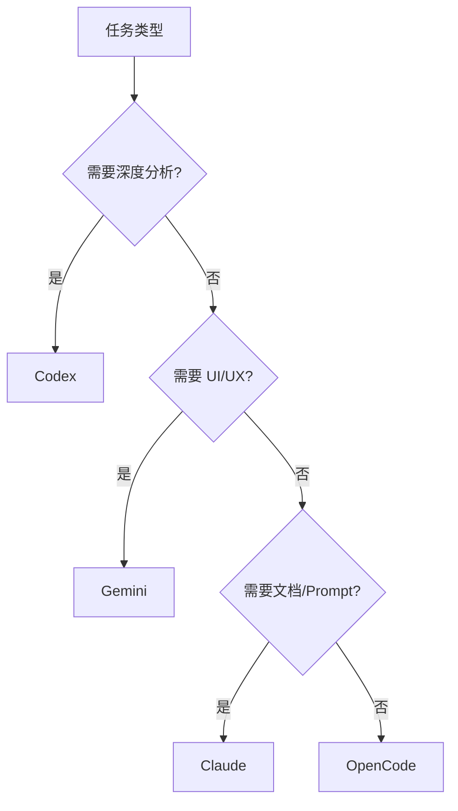

# codeagent-wrapper 使用指南

## 概述

`codeagent-wrapper` 是一个多后端 AI 代码任务执行器，提供统一的接口调用不同的 AI 后端（Codex、Claude、Gemini、OpenCode）来执行代码相关任务。

**核心能力**：
- 多后端支持（Codex、Claude、Gemini、OpenCode）
- 文件引用语法（`@file`）
- 并行任务执行
- Session 恢复机制
- Worktree 隔离模式
- Agent 预设配置

## 安装位置

```bash
~/.claude/bin/codeagent-wrapper
```

## 后端选择

| 后端 | 最适用场景 | 默认模型 |
|------|-----------|---------|
| **Codex** | 深度代码分析、大规模重构、算法优化 | gpt-5.2 |
| **Claude** | 快速功能实现、文档生成、Prompt 工程 | claude-sonnet-4.5 |
| **Gemini** | UI 组件搭建、设计系统实现 | gemini-3-pro-preview |
| **OpenCode** | 代码探索、快速原型 | opencode/grok-code |

### 后端选择决策树



## 基础用法

### 1. 单任务执行（推荐 HEREDOC 语法）

```bash
# Codex 后端 - 深度代码分析
~/.claude/bin/codeagent-wrapper --backend codex - . <<'EOF'
分析 @src/main.py 的架构并提出改进建议
EOF

# Claude 后端 - 快速文档生成
~/.claude/bin/codeagent-wrapper --backend claude - . <<'EOF'
为 @README.md 添加安装和使用说明
EOF

# Gemini 后端 - UI 原型
~/.claude/bin/codeagent-wrapper --backend gemini - . <<'EOF'
创建响应式导航组件
EOF
```

### 2. 简单任务（单行命令）

```bash
~/.claude/bin/codeagent-wrapper --backend claude "添加类型注解到 @utils.py" .
```

### 3. 文件引用语法

```bash
# 引用多个文件
~/.claude/bin/codeagent-wrapper --backend codex - . <<'EOF'
分析 @src/api.py 和 @src/models.py 的依赖关系
EOF

# 引用整个目录
~/.claude/bin/codeagent-wrapper --backend codex - . <<'EOF'
审查 @src/ 目录的安全性
EOF
```

## 高级功能

### 1. Session 恢复

**Session ID 管理**：
- 每次执行自动生成 UUID 格式的 session ID
- 存储位置：`/private/tmp/claude-501/<工作目录路径>/<session_id>/`
- 任务输出：`<session_id>/tasks/*.output`

**恢复会话**：
```bash
~/.claude/bin/codeagent-wrapper --backend codex resume 262f0fea-eacb-4223-b842-b5b5097f94e8 - <<'EOF'
继续优化性能
EOF
```

**查看 session 输出**：
```bash
# 实时查看
tail -f /private/tmp/claude-501/<workdir>/<session_id>/tasks/<task_id>.output

# 查看最近 50 行
cat /private/tmp/claude-501/<workdir>/<session_id>/tasks/<task_id>.output | tail -50
```

### 2. 并行任务执行

**基础并行模式**：
```bash
~/.claude/bin/codeagent-wrapper --parallel <<'EOF'
---TASK---
id: analysis
backend: codex
workdir: /path/to/project
---CONTENT---
分析代码库结构
---TASK---
id: docs
backend: claude
dependencies: analysis
---CONTENT---
基于分析生成 API 文档
---TASK---
id: ui
backend: gemini
dependencies: docs
---CONTENT---
生成文档站点的 UI
EOF
```

**输出模式**：
- **Summary 模式**（默认）：结构化报告，节省上下文
- **Full 模式**（`--full-output`）：完整输出，仅用于调试

**并发控制**：
```bash
export CODEAGENT_MAX_PARALLEL_WORKERS=8
```

### 3. Worktree 隔离模式

自动创建隔离的 git worktree，适合实验性修改：

```bash
~/.claude/bin/codeagent-wrapper --worktree --backend codex "实现新功能 X" .
```

### 4. Agent 预设

使用预配置的 agent 能力组合：

```bash
# 使用规划 agent
~/.claude/bin/codeagent-wrapper --agent planner "规划重构方案" .

# 使用文档编写 agent
~/.claude/bin/codeagent-wrapper --agent document-writer "编写 API 文档" .
```

**可用预设**（定义在 `~/.codeagent/models.json`）：
- `oracle`: 深度推理（Claude Opus 4.5）
- `librarian`: 文档管理（Claude Sonnet 4.5）
- `explore`: 代码探索（OpenCode）
- `develop`: 开发实现（Codex + 高推理）
- `frontend-ui-ux-engineer`: 前端开发（Gemini Pro）
- `document-writer`: 文档生成（Gemini Flash）

### 5. Skills 注入

为任务注入特定的审查能力：

```bash
~/.claude/bin/codeagent-wrapper --backend codex \
  --skills "python-review,security-review" \
  "审查代码质量和安全性" .
```

### 6. 结构化输出

将结果输出为 JSON 文件，便于后续处理：

```bash
~/.claude/bin/codeagent-wrapper --backend claude \
  --output result.json \
  "分析代码复杂度" .
```

## 环境变量

| 变量 | 说明 | 默认值 |
|------|------|--------|
| `CODEX_TIMEOUT` | 任务超时时间（毫秒） | 7200000（2小时） |
| `CODEAGENT_SKIP_PERMISSIONS` | 跳过权限检查 | false |
| `CODEAGENT_MAX_PARALLEL_WORKERS` | 并行任务数上限 | 无限制（推荐 8） |

**使用示例**：
```bash
# 设置 1 小时超时
export CODEX_TIMEOUT=3600000

# 自动化脚本中跳过权限提示
export CODEAGENT_SKIP_PERMISSIONS=true

# 限制并发任务
export CODEAGENT_MAX_PARALLEL_WORKERS=8
```

## 维护命令

```bash
# 清理旧日志
~/.claude/bin/codeagent-wrapper cleanup

# 查看版本
~/.claude/bin/codeagent-wrapper version

# 查看帮助
~/.claude/bin/codeagent-wrapper --help
```

## 重要规则

### ⚠️ 永远不要 kill codeagent 进程

**原因**：
- 长时间运行（2-10 分钟）是正常的
- Kill 会浪费 API 成本并丢失进度

**正确做法**：

1. **检查任务状态**：
   ```bash
   tail -f /private/tmp/claude-501/<workdir>/<session_id>/tasks/<task_id>.output
   ```

2. **使用 TaskOutput 工具等待**：
   ```bash
   TaskOutput(task_id="<id>", block=true, timeout=300000)
   ```

3. **检查进程状态**（不 kill）：
   ```bash
   ps aux | grep codeagent-wrapper | grep -v grep
   ```

## 常见使用场景

### 场景 1：代码审查和改进

```bash
# 步骤 1：深度分析
~/.claude/bin/codeagent-wrapper --backend codex - . <<'EOF'
深度分析 @src/ 目录的架构问题
EOF

# 步骤 2：安全审查
~/.claude/bin/codeagent-wrapper --backend codex \
  --skills "security-review" \
  "审查安全漏洞" .

# 步骤 3：生成改进方案
~/.claude/bin/codeagent-wrapper --backend claude - . <<'EOF'
基于分析结果生成重构方案
EOF
```

### 场景 2：文档生成工作流

```bash
~/.claude/bin/codeagent-wrapper --parallel <<'EOF'
---TASK---
id: readme
backend: claude
workdir: /path/to/project
---CONTENT---
生成 README.md，包括项目介绍、安装步骤、使用示例
---TASK---
id: api-docs
backend: claude
workdir: /path/to/project
---CONTENT---
为 @src/api.py 生成 API 文档
---TASK---
id: changelog
backend: claude
dependencies: readme, api-docs
workdir: /path/to/project
---CONTENT---
生成 CHANGELOG.md
EOF
```

### 场景 3：UI 原型开发

```bash
# 分析设计需求
~/.claude/bin/codeagent-wrapper --backend claude - . <<'EOF'
分析产品需求文档，提取 UI 组件需求
EOF

# 生成组件代码
~/.claude/bin/codeagent-wrapper --backend gemini - . <<'EOF'
根据需求生成 React 组件原型
EOF
```

### 场景 4：大规模重构

```bash
# 在隔离的 worktree 中进行
~/.claude/bin/codeagent-wrapper --worktree --backend codex - . <<'EOF
重构 @src/core 模块，优化依赖关系
1. 分析现有依赖图
2. 识别循环依赖
3. 提出重构方案
4. 实施重构
EOF
```

## 配置文件

### models.json 位置

```bash
~/.codeagent/models.json
```

### 配置结构

```json
{
  "default_backend": "codex",
  "default_model": "gpt-5.2",
  "backends": {
    "codex": { "api_key": "" },
    "claude": { "api_key": "" },
    "gemini": { "api_key": "" },
    "opencode": { "api_key": "" }
  },
  "agents": {
    "oracle": {
      "backend": "claude",
      "model": "claude-opus-4-5-20251101",
      "yolo": true
    }
  }
}
```

## 最佳实践

### 1. 根据任务选择后端

- **代码分析** → Codex（深度理解）
- **文档生成** → Claude（快速准确）
- **UI 开发** → Gemini（界面专业）
- **快速探索** → OpenCode（轻量快速）

### 2. 使用 HEREDOC 语法

避免 shell 转义问题，提高可读性：

```bash
# ✅ 推荐
codeagent-wrapper --backend codex - . <<'EOF'
多行任务描述
包含复杂逻辑
EOF

# ❌ 避免
codeagent-wrapper --backend codex "复杂\"转义\"问题" .
```

### 3. 明确引用文件

使用 `@file` 语法提高精度：

```bash
codeagent-wrapper --backend codex "分析 @src/api.py" .
```

### 4. 并行优化

- **独立任务**：并行执行
- **依赖任务**：使用 `dependencies` 字段串行

### 5. Session 管理

对于复杂任务，记录 session ID 以便恢复：

```bash
# 任务完成后，session ID 会显示在输出末尾
# 示例：SESSION_ID: 262f0fea-eacb-4223-b842-b5b5097f94e8
```

## 故障排查

### 问题 1：任务长时间运行

**检查方法**：
```bash
tail -f /private/tmp/claude-501/<workdir>/<session_id>/tasks/<task_id>.output
```

**解决**：
- 正常现象，等待完成
- 如需中断，联系用户决定

### 问题 2：权限提示阻塞自动化

**解决**：
```bash
export CODEAGENT_SKIP_PERMISSIONS=true
```

### 问题 3：并行任务资源耗尽

**解决**：
```bash
export CODEAGENT_MAX_PARALLEL_WORKERS=8
```

## 参考资源

- **Skill 文档**：[.claude/skills/codeagent/SKILL.md](../../.claude/skills/codeagent/SKILL.md)
- **配置文件**：`~/.codeagent/models.json`
- **Session 存储**：`/private/tmp/claude-501/`

## 更新历史

- 2026-03-17：初始版本，基于 codeagent-wrapper 当前功能编写