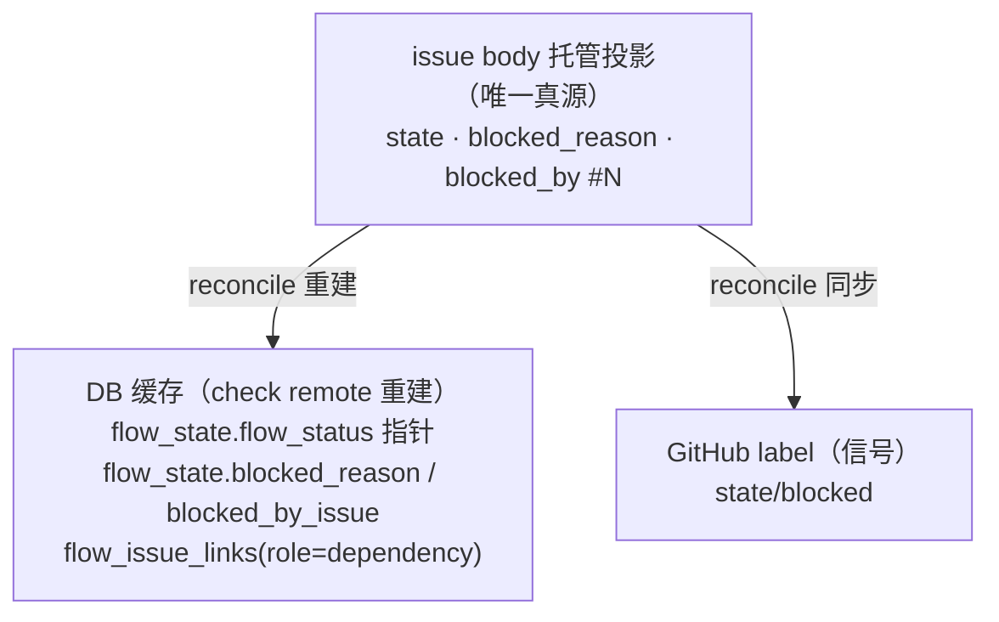

# Blocked / Dependency 状态与对账标准

**维护者**: Vibe Team
**最后更新**: 2026-06-29
**状态**: Active（权威）
**文档类型**: 标准

> 上级索引: [.claude/rules/README.md](../../../.claude/rules/README.md)
> 术语真源: [glossary.md](../glossary.md)

---

## 0. 本文定位与废止关系

本文是 **blocked / dependency 状态的真源模型、写入与清除原语、check remote 对账机制、以及 resume 语义**的**单一权威标准**。

在此之前，相关语义分散在 4 份文档且**互相矛盾**（尤其"依赖真源在哪"有三种说法）。本文统一裁定，并**废止以下文档中与本文冲突的部分**：

| 文档 | 被本文取代/对齐的部分 |
|------|----------------------|
| [coordination-truth.md](../../v3/architecture/coordination-truth.md) | Truth Table（保留 degraded mode 描述，真源归属以本文为准） |
| [dependency-handling.md](../../v3/architecture/dependency-handling.md) | "flow_issue_links 是真源"的声明（改为缓存）；qualify gate 三步语义保留并归一到 §6 |
| [issue-dependency-standard.md](../issue-dependency-standard.md) §2 | "依赖真源 = flow_issue_links + body `## Dependencies` 段"（改为 body 托管投影为唯一真源） |
| [flow-lifecycle-standard.md](../flow-lifecycle-standard.md) §1 | "三个真源"表述（改为单一真源 + 缓存 + 信号） |

**本文回答**：blocked/dependency 的真源是什么？谁写、谁清、怎么清？check remote、orchestra 检查、task resume 三者什么关系？flow_status 是什么？

**本文不回答**：有哪些 label（见 [github-labels-reference.md](../github-labels-reference.md)）；scope 拆分/Epic/RFC（见 [issue-dependency-standard.md](../issue-dependency-standard.md) §3-6，该部分不受本文影响）。

---

## 1. 核心原则（不可协商）

1. **远端单一真源**：GitHub issue body 的托管投影段是 blocked/dependency 状态的**唯一真源**。本地 SQLite（`flow_state`、`flow_issue_links`）一律是**缓存**，由 check remote 从 body 重建。
2. **统一原语**：blocked_reason 与 blocked_task 的写入/清除必须经过统一底层方法，禁止各路径各写各的。
3. **flow_status 是指针**：`flow_state.flow_status` 是对真源的派生投影，**只能被对账结果改变，禁止作为阻塞判定的触发源或真源**。
4. **对账归一**：check remote、orchestra qualify、task resume 共用同一套对账核，**唯一差异是 task resume 会清除 blocked_reason**。
5. **依赖只能靠关闭解除**：blocked_task（依赖）无手工解除入口；只能通过关闭被依赖 issue 或在 body 移除该依赖来解除。check remote 据此清理本地依赖缓存。
6. **保守阻塞**：真源不可读（degraded mode）时，宁可保持 blocked 也不误派发。

---

## 2. 真源 / 缓存 / 信号 三层模型



### 2.1 字段归属表

| 概念 | 真源（body 托管投影） | 缓存（DB，由 reconcile 重建） | 信号（label） |
|------|----------------------|------------------------------|--------------|
| 是否阻塞 | 投影 `State`（active/blocked） | `flow_state.flow_status`（指针） | `state/blocked` |
| 手工原因 | `Blocked reason:` 行 | `flow_state.blocked_reason` | —（仅 state/blocked） |
| 依赖任务 | `Blocked by:` 行（`#N`，多值） | `flow_state.blocked_by_issue`（派生主依赖）+ `flow_issue_links(role=dependency)`（全集缓存） | —（仅 state/blocked） |

### 2.2 投影字段规范（body 托管段）

托管段（`<!-- vibe3-flow-state-start/end -->`）只允许以下字段：

- `State`: `active` | `blocked`
- `Blocked reason`: 手工阻塞原因（单条文本）
- `Blocked by`: 依赖任务 issue 列表（`#N, #M`）

**退役** `Dependencies:` 字段：它与 `Blocked by` 语义重复且当前无生产写入者（dead）。依赖任务统一用 `Blocked by` 表达。

### 2.3 flow_status 指针语义

`flow_state.flow_status` 是真源的派生缓存，遵循：

- **只写不判**：只能由 reconcile 依据真源写入；**禁止**任何阻塞/恢复判定以 `flow_status == "blocked"` 作为触发条件或真源。
- 需要"是否阻塞"时，一律经 reconcile 读取 body 真源（degraded 时回退缓存，见 §6.4）。

---

## 3. 两类阻塞

| 类型 | 含义 | 真源字段 | 解除方式 |
|------|------|---------|---------|
| **blocked_reason（手工阻塞）** | 人工判断需要停下（等外部反馈、人工介入等） | body `Blocked reason` | `task resume` 显式清除 |
| **blocked_task（依赖阻塞）** | 本 issue 依赖其他 issue 完成 | body `Blocked by` | **仅**关闭被依赖 issue，或在 body 移除该依赖 |

二者可共存。**effective_blocked = 存在 blocked_reason，或存在任一未关闭的 blocked_task。**

---

## 4. 统一底层原语

所有写入/清除必须经过下列原语（落在 `BlockedStateService` 同层）：

```
set_block(issue, branch, *, reason: str | None, tasks: list[int]):
    # 写真源 body（reason 与 tasks 可分别累加），随后 reconcile 重建缓存+信号
    # reason 与单次 tasks 互斥由调用层校验

clear_block(issue, branch, *, clear_reason: bool):
    # 见 §6 reconcile_blocked —— clear_reason=True 时清除 body 的 Blocked reason
    # 依赖任务不在此清除（只能靠关闭被依赖 issue / body 移除）
```

**约束**：

- 原语只改 body 真源；缓存（`flow_state`、`flow_issue_links`）与 label 一律由 reconcile 从 body 重建，不允许旁路直写缓存当真源。
- **无 `unlink_dependency` 手工入口**（原则 5）。依赖的消失只有两个合法来源：被依赖 issue 关闭、或 body `Blocked by` 被移除。

---

## 5. 写入路径（全部归一到原语）

| 命令 | 写入 | 经过原语 |
|------|------|---------|
| `vibe flow blocked --reason R` (shell) | body `Blocked reason` | `set_block(reason=R)` |
| `vibe flow blocked --task N` (shell) | body `Blocked by #N` | `set_block(tasks=[N])` |
| `vibe flow bind <issue> --role dependency` (shell) | 同 `--task`（等效） | `set_block(tasks=[...])` |
| `vibe task intake --blocked-by N` (shell) | 空 flow scene + body `Blocked by #N` | `set_block(tasks=[N])` |
| `vibe task intake --blocked-reason R` (shell) | 空 flow scene + body `Blocked reason` | `set_block(reason=R)` |

**约定**：

- `intake` 在"只有 issue 无 flow"时先创建 placeholder flow scene（DB 记录，skip_git），再经原语写 body 真源。`--blocked-reason` 单独使用**必须**生效（不得静默丢弃）。
- 写入后缓存由 reconcile 重建，调用方不直接拼缓存。

---

## 6. 对账机制（唯一对账核）

check remote、orchestra qualify、task resume **共用同一对账核**，差异仅 `clear_reason`：

```
reconcile_blocked(issue, branch, *, clear_reason: bool) -> IssueState | None:
    truth = read_body_truth(issue)                 # 唯一真源: reason, blocked_by[]
    if clear_reason:                               # 仅 task resume 传 True
        truth = truth.drop_reason()
        write_body_truth(issue, truth)             # 从 body 抹除 Blocked reason
    open_tasks = [t for t in truth.blocked_by if not is_closed(t)]   # 关闭=满足
    effective_blocked = bool(truth.reason) or bool(open_tasks)
    if effective_blocked:
        sync_label(issue, BLOCKED)
        target = None                              # 保持阻塞
    else:
        target = infer_resume_label(branch)        # 推定恢复状态
        write_body_truth(issue, active)            # 清 body 阻塞段
        sync_label(issue, target)
    rebuild_cache_from_truth(branch, truth, open_tasks)   # flow_state + flow_issue_links
    return target
```

### 6.1 三个入口的关系

| 入口 | `clear_reason` | 语义 |
|------|---------------|------|
| `task resume`（人工恢复） | `True` | 清手工原因；若无未关闭依赖 -> 恢复推定状态；若依赖仍在 -> 保持 state/blocked |
| check remote（`vibe check`） | `False` | 只确认 body 真源是否仍阻塞；恢复了就恢复，仍阻塞就保持 |
| orchestra qualify（派发对账） | `False` | 同 check remote（应调用同一对账核，不另写一套） |

### 6.2 resume 精确语义（原则 3）

`task resume` = `reconcile_blocked(clear_reason=True)`：

1. 清除 body `Blocked reason`。
2. 若 `Blocked by` 已无未关闭依赖 -> `infer_resume_label` 推定状态并恢复。
3. 若仍有未关闭依赖 -> **保持 `state/blocked` 不变，不得强行清理**。

### 6.3 依赖缓存清理（原则 5）

`rebuild_cache_from_truth` 必须使 `flow_issue_links(role=dependency)` 与 body `Blocked by` **一致**：

- body 已移除某依赖 -> 删除对应 `flow_issue_links`。
- 被依赖 issue 已关闭 -> 该依赖从"未满足"集合移除（缓存可保留历史，但不再计入 effective_blocked）。

### 6.4 degraded mode（原则 6）

body 不可读（GitHub API 故障）时，回退本地缓存只读，**保守保持 blocked**，记录降级事件，**不得在降级期执行 resume/清理**。

---

## 7. flow_status 禁止用法清单

- ❌ 以 `flow_state.flow_status == "blocked"` 作为 resume / auto-resume 触发条件。
- ❌ 以 label（state/blocked 增删）作为阻塞真源去回写缓存/body。
- ❌ 在缓存里伪造 `blocked_reason` / `blocked_by_issue`（必须来自 body 真源）。
- ✅ `flow_status` 仅由 `reconcile_blocked` 依据 body 真源写入，供展示与派发可见性使用。

---

## 8. 退役项

| 退役对象 | 处理 |
|---------|------|
| body `Dependencies:` 字段 | 合并入 `Blocked by`，停止解析/渲染 |
| `CoordinationTruth.dependencies` + `check_dependencies` | 依赖门禁统一走 `blocked_by`（reconcile 的 open_tasks），移除死路径 |
| "flow_issue_links 为依赖真源"表述 | 改为缓存（见 §0 废止表） |
| `flow_status` 作为触发源的所有判定 | 改为读 body 真源（见 §7） |

---

## 9. 与其他标准的关系

- 真源/缓存/对账冲突时，**以本文为准**；§0 废止表列出被取代的具体部分。
- 标签语义：[github-labels-standard.md](../github-labels-standard.md)、[label-semantics.md](../label-semantics.md)。
- 数据库结构：[v3/database-schema-standard.md](database-schema-standard.md)（`flow_state`、`flow_issue_links` 列定义）。
- 错误 vs 阻塞边界：[v3/error-severity-and-blocking-standard.md](error-severity-and-blocking-standard.md)、[v3/architecture/error-block-decoupling.md](../../v3/architecture/error-block-decoupling.md)。
- 当前实现与本标准的差距清单：[blocked-dependency-reconciliation-gaps.md](blocked-dependency-reconciliation-gaps.md)。

---

## 10. 变更历史

| 日期 | 版本 | 变更 |
|------|------|------|
| 2026-06-29 | 1.0 | 初版。裁定 body 为唯一真源，统一写/清原语与对账核，退役死字段与 flow_status 触发用法 |
