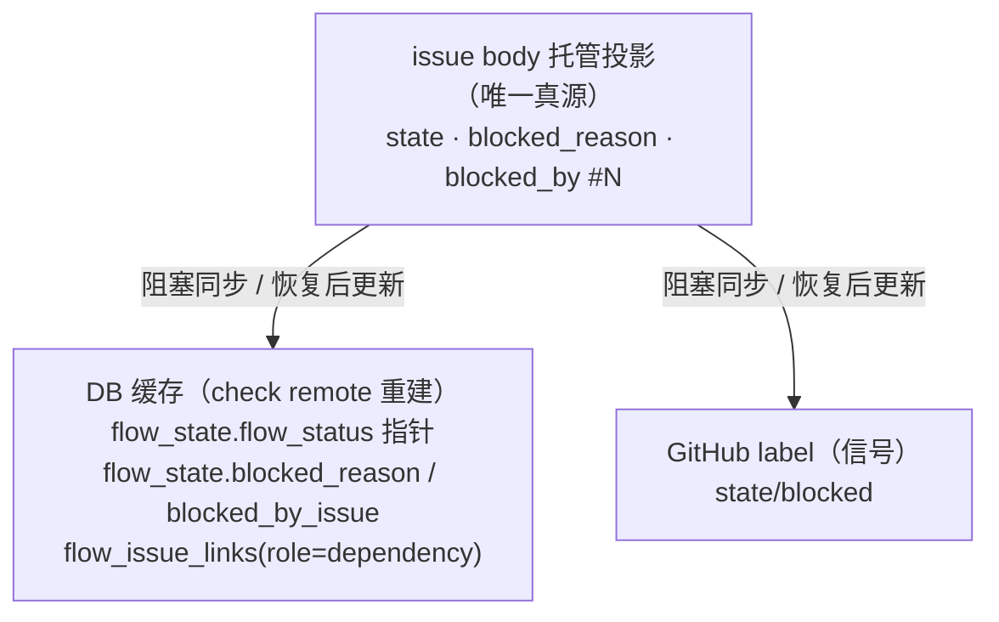

# Blocked / Dependency 状态与对账标准

**维护者**: Vibe Team
**最后更新**: 2026-09-26
**状态**: Active（权威）
**文档类型**: 标准

> 上级索引: [.claude/rules/README.md](../../../.claude/rules/README.md)
> 术语真源: [glossary.md](../glossary.md)

---

## 0. 本文定位与废止关系

本文是 **blocked / dependency 状态的真源模型、写入与清除原语、check remote 对账机制、以及 resume 语义**的**单一权威标准**。

在此之前，相关语义分散在 4 份文档且**互相矛盾**（尤其"依赖真源在哪"有三种说法）。本文统一裁定，并**废止以下文档中与本文冲突的部分**：

| 文档 | 被本文取代/对齐的部分 |
|------|----------------------|
| [coordination-truth.md](../../v3/architecture/coordination-truth.md) | Truth Table（保留 degraded mode 描述，真源归属以本文为准） |
| [dependency-handling.md](../../v3/architecture/dependency-handling.md) | "flow_issue_links 是真源"的声明（改为缓存）；qualify gate 三步语义保留并归一到 §6 |
| [issue-dependency-standard.md](../issue-dependency-standard.md) §2 | "依赖真源 = flow_issue_links + body `## Dependencies` 段"（改为 body 托管投影为唯一真源） |
| [flow-lifecycle-standard.md](../flow-lifecycle-standard.md) §1 | "三个真源"表述（改为单一真源 + 缓存 + 信号） |

**本文回答**：blocked/dependency 的真源是什么？谁写、谁清、怎么清？check remote、orchestra 检查、task resume 三者什么关系？flow_status 是什么？

**本文不回答**：有哪些 label（见 [github-labels-reference.md](../github-labels-reference.md)）；scope 拆分/Epic/RFC（见 [issue-dependency-standard.md](../issue-dependency-standard.md) §3-6，该部分不受本文影响）。

---

## 1. 核心原则（不可协商）

1. **远端单一真源**：GitHub issue body 的托管投影段是 blocked/dependency 状态的**唯一真源**。本地 SQLite（`flow_state`、`flow_issue_links`）一律是**缓存**，由 check remote 从 body 重建。
2. **分离权限**：写入阻塞、同步阻塞、自动恢复资格检查与人工恢复使用独立入口；只有显式人工恢复可以清除手工 `blocked_reason`。
3. **flow_status 是指针**：`flow_state.flow_status` 是业务状态的本地投影，**禁止作为阻塞判定的唯一真源**。
4. **只读资格检查**：check remote 与 orchestra qualify 可同步阻塞投影；自动恢复须先只读评估，再消费绑定远端快照的决定，不得从 refs 推断目标状态。
5. **依赖只能靠关闭解除**：blocked_task（依赖）无手工解除入口；只能通过关闭被依赖 issue 或在 body 移除该依赖来解除。check remote 据此清理本地依赖缓存。
6. **保守阻塞**：真源不可读（degraded mode）时，宁可保持 blocked 也不误派发。

---

## 2. 真源 / 缓存 / 信号 三层模型


```mermaid
flowchart TD
    BODY["issue body 托管投影<br/>（唯一真源）<br/>state · blocked_reason · blocked_by #N"]
    CACHE["DB 缓存（check remote 重建）<br/>flow_state.flow_status 指针<br/>flow_state.blocked_reason / blocked_by_issue<br/>flow_issue_links(role=dependency)"]
    LABEL["GitHub label（信号）<br/>state/blocked"]
    BODY -->|阻塞同步 / 恢复后更新| CACHE
    BODY -->|阻塞同步 / 恢复后更新| LABEL
```

### 2.1 字段归属表

| 概念 | 真源（body 托管投影） | 缓存（DB，由阻塞状态服务同步） | 信号（label） |
|------|----------------------|------------------------------|--------------|
| 是否阻塞 | 投影 `State`（active/blocked） | `flow_state.flow_status`（指针） | `state/blocked` |
| 手工原因 | `Blocked reason:` 行 | `flow_state.blocked_reason` | —（仅 state/blocked） |
| 依赖任务 | `Blocked by:` 行（`#N`，多值） | `flow_state.blocked_by_issue`（派生主依赖）+ `flow_issue_links(role=dependency)`（全集缓存） | —（仅 state/blocked） |

### 2.2 投影字段规范（body 托管段）

托管段（`<!-- vibe3-flow-state-start/end -->`）只允许以下字段：

- `State`: `active` | `blocked`
- `Blocked reason`: 手工阻塞原因（单条文本）
- `Blocked by`: 依赖任务 issue 列表（`#N, #M`）

**退役** `Dependencies:` 字段：它与 `Blocked by` 语义重复且当前无生产写入者（dead）。依赖任务统一用 `Blocked by` 表达。

### 2.3 flow_status 指针语义

`flow_state.flow_status` 是真源的派生缓存，遵循：

- **不作唯一依据**：不得仅凭 `flow_status == "blocked"` 判定 reason 与依赖已解除。
- 需要判断恢复资格时，读取远端 body、依赖状态与 label；不可读时保持阻塞，见 §6.4。

---

## 3. 两类阻塞

| 类型 | 含义 | 真源字段 | 解除方式 |
|------|------|---------|---------|
| **blocked_reason（手工阻塞）** | 人工判断需要停下（等外部反馈、人工介入等） | body `Blocked reason` | `task resume` 显式清除 |
| **blocked_task（依赖阻塞）** | 本 issue 依赖其他 issue 完成 | body `Blocked by` | **仅**关闭被依赖 issue，或在 body 移除该依赖 |

二者可共存。**effective_blocked = 存在 blocked_reason，或存在任一未关闭的 blocked_task。**

---

## 4. 统一底层原语

所有写入/清除必须经过下列原语（落在 `BlockedStateService` 同层）：

```
set_block(issue, branch, *, reason: str | None, tasks: list[int]):
    # 写真源 body（reason 与 tasks 可分别累加），随后同步阻塞缓存和信号
    # reason 与单次 tasks 互斥由调用层校验

sync_block_state(issue, branch):
    # 只同步仍然有效的阻塞投影；不清 reason，不恢复状态

manual_resume(issue, branch, *, actor, reason, target_state=None):
    # 显式人工授权；检查远端真源和依赖后清 reason、恢复 label
```

**约束**：

- `set_block()` 先写 body，再调用 `sync_block_state()` 对齐缓存与 label；恢复入口在远端检查通过后更新 body、缓存与 label，不允许旁路直写缓存当真源。
- **无 `unlink_dependency` 手工入口**（原则 5）。依赖的消失只有两个合法来源：被依赖 issue 关闭、或 body `Blocked by` 被移除。

---

## 5. 写入路径（全部归一到原语）

| 命令 | 写入 | 经过原语 |
|------|------|---------|
| `vibe flow blocked --reason R` (shell) | body `Blocked reason` | `set_block(reason=R)` |
| `vibe flow blocked --task N` (shell) | body `Blocked by #N` | `set_block(tasks=[N])` |
| `vibe flow bind <issue> --role dependency` (shell) | 同 `--task`（等效） | `set_block(tasks=[...])` |
| `vibe task intake --blocked-by N` (shell) | 空 flow scene + body `Blocked by #N` | `set_block(tasks=[N])` |
| `vibe task intake --blocked-reason R` (shell) | 空 flow scene + body `Blocked reason` | `set_block(reason=R)` |

**约定**：

- `intake` 在"只有 issue 无 flow"时先创建 placeholder flow scene（DB 记录，skip_git），再经原语写 body 真源。`--blocked-reason` 单独使用**必须**生效（不得静默丢弃）。
- 写入后缓存由 `sync_block_state()` 对齐，调用方不直接拼缓存。

---

## 6. 阻塞同步与恢复

`BlockedStateService` 使用分离的入口。`sync_block_state()` 只把仍然有效的阻塞真源同步到缓存和 label；真源已不阻塞时，它不会推断目标或执行恢复。

自动恢复分两步：`evaluate_auto_eligibility()` 只读 issue body 与 `updatedAt`，要求手工 reason 为空且每个依赖已确认关闭；`apply_auto_resume()` 重新核对快照和 `state/blocked` label，再将已有 flow 交给 `state/handoff`，无 flow 现场的 issue 交给 `state/ready`。真源不可读、label 不一致或决定已过期时保持 blocked，不改业务状态。

显式 `task resume` 调用 `manual_resume()`。它读取远端真源和 label，默认在依赖未关闭时拒绝恢复；通过检查后才清除手工 reason，并使用人工指定或人工路径解析出的目标。当前实现还暴露 `force=True` 覆盖依赖检查；其权限边界仍由 [#3289](https://github.com/jacobcy/vibe-coding-control-center/issues/3289) 验收，不属于自动恢复。

### 6.1 三个入口的关系

| 入口 | 方法 | 语义 |
|------|------|------|
| `task resume`（人工恢复） | `manual_resume()` | 人工授权后清 reason；默认要求依赖已关闭 |
| check remote（`vibe check`） | `sync_block_state()`；资格成立时 `evaluate_auto_eligibility()` + `apply_auto_resume()` | 同步阻塞，或按快照决定恢复 |
| orchestra qualify（派发对账） | 同上 | 不清手工 reason，不从 refs 推断目标 |

### 6.2 resume 精确语义（原则 3）

`task resume` 走人工授权入口：

1. 清除 body `Blocked reason`。
2. 默认要求 `Blocked by` 已无未关闭依赖，再按人工指定目标或人工路径的 resolver 恢复。
3. 若仍有未关闭依赖，普通恢复保持 `state/blocked` 不变；当前 `force=True` 例外见 §6。

### 6.3 依赖缓存清理（原则 5）

`rebuild_cache_from_truth` 必须使 `flow_issue_links(role=dependency)` 与 body `Blocked by` **一致**：

- body 已移除某依赖 -> 删除对应 `flow_issue_links`。
- 被依赖 issue 已关闭 -> 该依赖从"未满足"集合移除（缓存可保留历史，但不再计入 effective_blocked）。

### 6.4 degraded mode（原则 6）

body 不可读（GitHub API 故障）时，保守保持 blocked，记录降级事件，**不得在降级期执行 resume/清理**。自动恢复还要求可核对的 `updatedAt` 快照与当前 blocked label。

### 6.5 推断与循环证据边界

- 只有显式人工恢复可以在确认 authoritative label 为 `state/blocked` 后解析目标；自动恢复的目标固定为已有 flow 的 `handoff` 或无现场 issue 的 `ready`。
- active dispatch、check payload 解析、qualify 与普通 label 读取不得根据 ref/verdict 推断 state。
- 进入 blocked 与 blocked 恢复都是实际 transition，必须计入 total 与 state-pair 计数。
- unblock 不清零 transition count，也不删除 pair history；预算耗尽时保持 blocked。
- 只有显式 destructive `flow rebuild` 会开始新的 flow epoch 并重置 transition evidence。

---

## 7. flow_status 禁止用法清单

- ❌ 以 `flow_state.flow_status == "blocked"` 作为 resume / auto-resume 触发条件。
- ❌ 以 label（state/blocked 增删）作为阻塞真源去回写缓存/body。
- ❌ 在缓存里伪造 `blocked_reason` / `blocked_by_issue`（必须来自 body 真源）。
- ✅ 阻塞投影由 `sync_block_state()` 依据 body 真源同步；恢复由独立的人工或自动入口执行。

---

## 8. 退役项

| 退役对象 | 处理 |
|---------|------|
| body `Dependencies:` 字段 | 合并入 `Blocked by`，停止解析/渲染 |
| `CoordinationTruth.dependencies` + `check_dependencies` | 依赖门禁统一走 `blocked_by` 真源和逐项依赖检查，移除死路径 |
| "flow_issue_links 为依赖真源"表述 | 改为缓存（见 §0 废止表） |
| `flow_status` 作为触发源的所有判定 | 改为读 body 真源（见 §7） |

---

## 9. 过程与配套规范（Scope 拆分与 Epic/RFC 机制）

本节内容继承自已废止的 `issue-dependency-standard.md`，规范了依赖关系在外延生命周期（拆分、标记、评论、展示）中的表现：

### 9.1 Scope 拆分决策模型（两个窗口）

Issue Scope 拆分有**两个明确的时间窗口**，超出窗口后禁止拆分：

| 窗口 | 角色 | 触发条件 | 决策权 |
|------|------|----------|--------|
| **窗口 1: Roadmap 阶段** | Roadmap decider | Issue 在 `roadmap/*` 状态，未进入 `state/ready` | 可拆分 / 继续单 issue / 标记 `roadmap/rfc` |
| **窗口 2: Manager 阶段** | Manager | Issue 从 `state/ready` → `state/claimed` 前 | 可拆分 / 继续单 issue |
| **关闭** | Plan/Run/Review | Issue 已进入 `state/claimed` | **禁止拆分** |

#### 9.1.1 窗口 1：Roadmap 阶段
- **触发条件**：Issue 有 `roadmap/*` 标签，尚未进入执行状态（`state/ready` 及之后）。
- **决策者**：Roadmap decider（可能是 governance observer 或 manager）。
- **决策选项**：
  1. **继续单 issue**：Issue 范围合理，无需拆分
  2. **拆分为 Epic + Sub-issues**：创建 sub-issues，主 issue 添加 `roadmap/epic` 标签；主 issue 成为治理容器，不进入执行状态；Sub-issues 独立进入执行流程。
- **Comment marker**：`[roadmap decision] <决策内容>`
- **示例**：`[roadmap decision] Issue #456 范围过大，拆分为 #457, #458, #459。主 issue #456 标记为 epic。`

#### 9.1.2 窗口 2：Manager 阶段
- **触发条件**：Issue 在 `state/ready`，manager 准备 claim 前。
- **决策者**：Manager agent。
- **决策选项**：
  1. **继续单 issue**：直接 claim，进入 plan 阶段。
  2. **拆分**：调用 `check_scope_split_before_plan()` 判断是否需要拆分。若需要，创建 sub-issues，主 issue 添加 `roadmap/epic`，写 `[manager]` comment 说明拆分理由，主 issue 不进入 `state/claimed`。
- **硬性规则**：
  - **一旦 `state/claimed` 被设置，拆分窗口永久关闭**。
  - Plan、Run、Review agents **必须**按单 issue 执行，不得拆分。若发现 scope 过大，应记录 finding 并在 review 阶段提出。
- **Comment marker**：`[manager] <拆分说明>`
- **示例**：`[manager] Scope 拆分：#123 范围过大，拆分为 #124 (API 设计), #125 (实现), #126 (测试)。主 issue #123 保持治理容器。`

#### 9.1.3 Epic 主 Issue 的治理容器角色
当主 issue 被标记为 `roadmap/epic` 时，主 issue 作为治理容器，不直接执行（不 claim、不 plan、不 run）。Sub-issues 独立进入执行流程，各自有独立的 flow。主 issue 负责追踪整体进度和提供上下文背景说明。

### 9.2 Epic/RFC 标签语义

#### 9.2.1 `roadmap/epic` 标签
- **定义**：主 issue 有 Sub-issues，作为治理容器。
- **语义**：表示 issue 有 parent-child 结构关系，主 issue 作为治理容器不直接执行，由 sub-issues 独立执行。
- **添加时机**：Roadmap decider 或 Manager 在 claim 前判定需要拆分。

#### 9.2.2 `roadmap/rfc` 标签
- **定义**：Issue 处于 RFC/设计阶段，agent 无法判断目标、架构方向或拆分形态。
- **语义**：讨论维度，表示需要人类输入设计方案，或缺少明确的目标/架构决策。
- **添加与移除**：Roadmap decider 发现目标不明确或 agent 无法合理拆分子任务时添加；人类提供明确设计方案或 Issue 进入执行阶段时移除。

### 9.3 Comment Marker 约定
Comment marker 用于区分自动化评论 and 人类指令：
- **自动化评论**：由 agent 产生，带 marker。
- **人类指令**：由真实人类账号产生，不带 marker。

| Marker | 角色 | 用途 |
|--------|------|------|
| `[manager]` | Manager | 状态转换、质量判断、拆分说明、阻塞汇报 |
| `[roadmap decision]` | Roadmap decider | Scope 拆分决策、Epic/RFC 标记决定 |
| `[governance suggest]` | Governance observer | 治理建议、恢复建议、routing 建议 |
| `[plan]` | Planner | Plan 完成、范围澄清 |
| `[run]` | Executor | Run 完成、执行结论 |
| `[review]` | Reviewer | Review 裁决、合并建议 |

- **强制格式**：`[<marker>] <主要内容>`，且 marker 必须在行首（如 `[manager] Issue #123 拆分为...`）。

### 9.4 `task status` 展示规范
`task status` 命令应将 RFC 和 Epic issues 独立展示，不混入常规 `Blocked Issues` section。
- **RFC Items**：包含 `roadmap/rfc` 标签的 issues 显示在 `Roadmap RFC` section。
- **Epic Items**：包含 `roadmap/epic` 标签的 issues 显示在 `Roadmap Epic` section。
- **Blocked Items**：状态为 `BLOCKED` 且**不包含**上述两个标签的 issues 显示在 `Blocked Issues` section。

---

## 10. 与其他标准的关系

- 真源/缓存/对账冲突时，**以本文为准**；§0 废止表列出被取代的具体部分。
- 标签语义：[github-labels-standard.md](../github-labels-standard.md)、[label-semantics.md](../label-semantics.md)。
- 数据库结构：[v3/database-schema-standard.md](database-schema-standard.md)（`flow_state`、`flow_issue_links` 列定义）。
- 错误 vs 阻塞边界：[v3/error-severity-and-blocking-standard.md](error-severity-and-blocking-standard.md)、[v3/architecture/error-block-decoupling.md](../../v3/architecture/error-block-decoupling.md)。
- 当前实现与本标准的差距清单：[blocked-dependency-reconciliation-gaps.md](blocked-dependency-reconciliation-gaps.md)。

---

## 11. 变更历史

| 日期 | 版本 | 变更 |
|------|------|------|
| 2026-06-29 | 1.1 | 合并已废除的 `issue-dependency-standard.md` 中未过时的 §3-6 配套过程规范（包括拆分窗口、Epic/RFC 标签、Comment Marker 等） |
| 2026-06-29 | 1.0 | 初版。裁定 body 为唯一真源，统一写/清原语与对账核，退役死字段与 flow_status 触发用法 |
