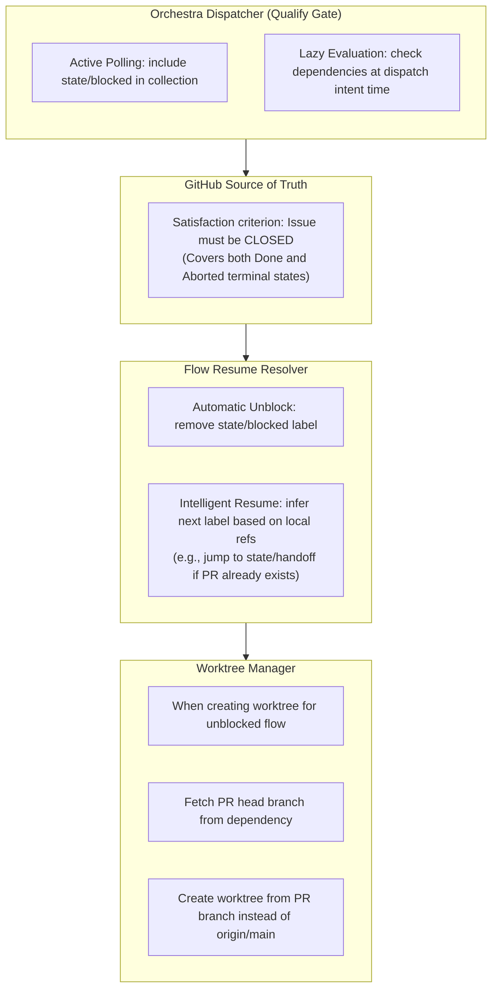

# Dependency Handling Mechanism (V3)

## Overview

Vibe Center 3.0 支持声明式依赖管理。当一个 flow 依赖其他 issue 时，系统采用 **Active Probing（主动嗅探）** 机制来确保逻辑闭环：

> **真源模型**：本文档中依赖的真源是 GitHub issue body 托管投影（`Blocked by` 行），本地 `flow_issue_links` 是 reconcile 重建的缓存。详见 [Blocked/Dependency Reconciliation Standard](../../standards/v3/blocked-dependency-reconciliation-standard.md) §2。

1. **定义即阻塞**: 绑定依赖时，系统自动将 flow 标记为 `blocked` 并同步 GitHub `state/blocked` 标签。
2. **主动巡逻**: Orchestra 调度器周期性巡检处于 `state/blocked` 的任务。
3. **自动解套**: 当所有依赖 Issue 均已 `closed` 时，调度器自动解除阻塞，智能推断并恢复到正确状态（如 `state/handoff`）。
4. **继承链**: 从依赖的 PR 分支创建依赖方的开发分支，确保代码基于依赖的最新版本。

## Architecture

## Architecture



## Key Components

### 1. Qualify Gate (资格门)

**Location**: `src/vibe3/domain/qualify_gate.py`

Orchestra 在发射派发意图前执行阻塞校验。三步校验已统一收拢至标准 `reconcile_blocked`（见 [Blocked/Dependency Reconciliation Standard §6](../../standards/v3/blocked-dependency-reconciliation-standard.md)），差异仅 `clear_reason` 参数。概要如下：
- **Step 1 (Manual)**: 检查本地 `blocked_reason`。如果有值，则保持阻塞。
- **Step 2 (Dependency)**: 检查 `flow_issue_links`。
  - **唯一满足判据**: GitHub `issue.state == "closed"`。
  - 只要有任何依赖项处于 `open`，则保持阻塞。
- **Step 3 (Unblock)**: 
  - 本地更新：清除 `blocked_by_issue`。
  - 远端更新：移除 `state/blocked`，同步新推断的标签。

### 2. Intelligent Resume (智能恢复)

**Location**: `src/vibe3/services/flow_resume_resolver.py`

当阻塞解除时，系统不再机械地回到 `state/ready`，而是根据本地现场推断目标状态：
- 有本地 PR -> `state/handoff` (交给 Manager)
- 有 Audit 结论 -> `state/in-progress` (需要根据审核修改)
- 有 Report 无 Audit -> `state/review` (代码已写，待审)
- 仅有 Plan -> `state/in-progress` (计划已定，待执行)
- 无产物 -> `state/claimed` (重新开始)

### 3. Branch Creation from PR Source

**Location**: `src/vibe3/environment/worktree.py`

当为解除阻塞的任务创建 Worktree 时：
1. 查找历史中的 `flow_unblocked` 事件。
2. 提取 `source_pr` 编号。
3. 从 GitHub 获取该 PR 的 `head_branch`。
4. 基于该分支创建新任务分支，实现“依赖继承”。

## Data Model

### Tables

- `flow_state`: 移除 `waiting` 状态，统一使用 `blocked`。
- `flow_issue_links`: `issue_role = 'dependency'` 存储依赖关系的本地缓存（真源为 body `Blocked by` 托管投影）。
- `flow_events`: 
  - `flow_blocked` - 任务进入阻塞
  - `flow_unblocked` - 依赖满足，任务恢复（带 `source_pr` 引用）

### Status Semantics

| Status  | Meaning                                    | Recovery                          |
|---------|--------------------------------------------|-----------------------------------|
| `active`| 正常执行中                                  | N/A                               |
| `blocked`| 被阻塞（手动原因或依赖未满足）                | 依赖项 Closed 后自动恢复，或人工解封 |
| `failed` | 执行过程报错                                | 需人工处理或修复环境                |
| `done`   | 已完成                                     | N/A                               |

## Usage

### Declaring Dependencies

使用命令绑定依赖：
```bash
vibe3 flow bind <dependency-issue-id> --role dependency
```
该命令会原子化地完成：
1. 通过 `set_block` 原语写入 body 真源（`Blocked by #N`）。
2. 缓存与 label 由 reconcile 从 body 重建。

## Fallback Behavior

- **PR 抓取失败**: 如果依赖项已 Close 但 PR 无法获取，将回退到 `origin/main` 并记录警告事件。
- **多重依赖**: 只有当**所有**绑定的依赖 Issue 在 GitHub 上均显示为 `closed` 时，解封逻辑才会触发。
