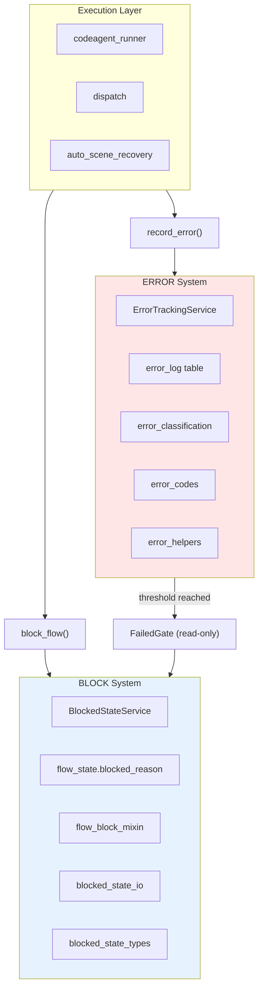

# ERROR/BLOCK Separation Architecture

## Design Principle

ERROR tracking and BLOCK management are two orthogonal systems that serve different purposes and must remain decoupled.

| | ERROR System | BLOCK System |
|---|---|---|
| **Purpose** | Track error frequency for threshold detection | Manage issue flow state (block/unblock) |
| **Storage** | `error_log` table in SQLite | `flow_state.blocked_reason` field + issue labels |
| **Trigger** | Exceptions, API failures, recovery events | Manual block, auto-block via FailedGate |
| **Output** | Error count, threshold reached flag | Blocked/unblocked state, fail issue |

## ERROR System

### Storage

Errors are stored in the `error_log` SQLite table via `ErrorTrackingService`.

### Control Flow

1. Exception occurs in execution layer
2. Error is classified via `classify_error_hybrid()`
3. Error is recorded via `record_error()` convenience function
4. `ErrorTrackingService` writes to `error_log` table
5. `FailedGate.check()` reads `error_log` on heartbeat tick
6. If threshold reached, `FailedGate` triggers BLOCK

### Recording Errors

Use the `record_error()` convenience function from `services.error_helpers`:

```python
from vibe3.services.shared.errors import record_error

# Minimal call
record_error(
    error_code="E_MODEL_NOT_FOUND",
    error_message="Model xyz not found",
)

# With all parameters
record_error(
    error_code="E_API_RATE_LIMIT",
    error_message="GitHub API rate limit exceeded",
    tick_id=42,
    issue_number=1357,
    branch="task/issue-1357",
    store=store_instance,
    severity=ErrorSeverity.ERROR,
)
```

### Error Codes

Pre-registered error codes live in `vibe3.exceptions.error_codes`:

- `E_MODEL_*` — Model/preset resolution errors
- `E_API_*` — External API errors (rate limit, unavailable)
- `E_EXEC_*` — Execution engine errors

### Error Severity

Severity levels are defined in `vibe3.exceptions.error_severity` and mapped via error handling contracts in `vibe3.exceptions.error_classification`.

## BLOCK System

### Storage

Blocked states are stored in the `flow_state` table (via `BlockedStateService`) and reflected in issue labels (`state/blocked`).

### Control Flow

1. Block condition triggered (manual or auto via FailedGate)
2. `block_flow()` is called via `FlowBlockMixin`
3. `BlockedStateService` writes to `flow_state.blocked_reason`
4. Issue label set to `state/blocked`
5. Unblock removes the state and restores issue label

### Blocking Flows

Use the `block_flow()` method from `FlowService`:

```python
from vibe3.services.flow_service import FlowService

FlowService(store=store_instance).block_flow(
    branch="task/issue-1357",
    reason="Auto-blocked: error threshold exceeded",
)
```

## When to Use Which System

| Scenario | System | Function |
|----------|--------|----------|
| API call fails | ERROR | `record_error()` |
| Error count exceeds threshold | BLOCK (via FailedGate) | Automatic |
| Manual issue blocking | BLOCK | `block_flow()` |
| Scene recovery triggered | ERROR | `record_error()` |
| Governance scan fails | ERROR | `record_error()` |
| Issue needs human attention | BLOCK | `block_flow()` |

## Architecture Diagram



Key constraint: ERROR system writes to `error_log`, BLOCK system writes to `flow_state.blocked_reason`. The only coupling point is `FailedGate`, which reads `error_log` (read-only) and may trigger a BLOCK.
