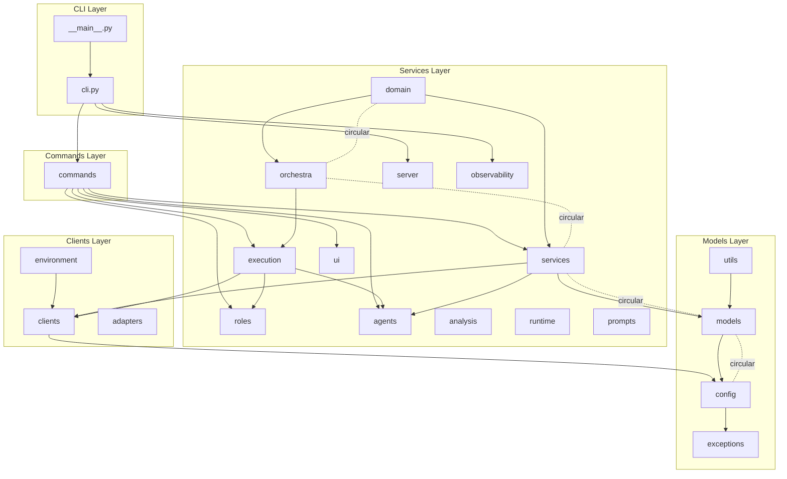

# Module Dependency Documentation (V3)

本文档定义了 Vibe3 系统中 22 个模块的依赖关系，旨在提供系统架构的可视化视图，并识别循环依赖风险点。

## 1. 依赖关系图

以下图表展示了模块之间的主要依赖流向。

## 2. 依赖关系表

| 模块 | 职责描述 | 主要依赖 (Dependencies) | 被依赖 (Dependents) | 风险等级 |
|---|---|---|---|---|
| **cli.py** | CLI 主入口，路由分发 | commands, server, observability | main | Low |
| **__main__.py** | 进程入口 (vibe3 serve) | cli | (none) | Low |
| **commands** | CLI 子命令实现 | agents, services, execution, roles, ui | cli | Low |
| **services** | 核心业务逻辑 (flow/PR/task) | agents, clients, config, models, utils | commands, orchestra, domain | **High (Circular)** |
| **orchestra** | 编排中枢 (issue 分诊) | execution, domain, services, models | runtime, domain, services | **High (Circular)** |
| **execution** | 执行控制平面 (coordinator) | agents, clients, roles, orchestra | commands, orchestra, domain | **High (Circular)** |
| **domain** | 领域事件与 Handlers | orchestra, services, models, roles | orchestra, services, server | **High (Circular)** |
| **roles** | 角色定义与执行模块 | agents, services, orchestra, domain | commands, execution, orchestra | **High (Circular)** |
| **agents** | AI Agent 调用层 (pipeline) | execution, prompts, models, config | commands, services, execution | **High (Circular)** |
| **analysis** | 代码智能与影响分析 | clients, models, services | agents, commands, roles | **High (Circular)** |
| **runtime** | 事件驱动运行时 (EventBus) | orchestra, models, config | server, domain | Low |
| **server** | HTTP / Webhook 服务 | runtime, domain, execution, agents | cli, commands | Low |
| **observability** | 日志、审计、可观测性 | (none) | cli, orchestra, services | Low |
| **prompts** | Prompt 模板与变量解析 | services, exceptions | agents, commands, roles | **High (Circular)** |
| **ui** | CLI 输出渲染 (Rich) | models, prompts, utils | commands | Low |
| **clients** | 外部客户端 (Git, GitHub, AI) | config, models, exceptions | (most modules) | **High (Circular)** |
| **adapters** | 逻辑适配器与集成桥接 | config | config | **High (Circular)** |
| **environment** | 环境资源管理 (Worktree) | clients, services, utils | execution, orchestra, roles | **High (Circular)** |
| **models** | Pydantic 领域数据模型 | config, services, utils | (most modules) | **High (Circular)** |
| **config** | 配置加载与 Schema | models, adapters, exceptions | (most modules) | **High (Circular)** |
| **exceptions** | 统一异常层级 | (none) | (most modules) | Low |
| **utils** | 通用工具函数 | models, services, config | (most modules) | **High (Circular)** |

## 3. 依赖规则说明

### 3.1 允许的依赖方向
*   **自上而下**: CLI → Commands → Services → Clients → Models。
*   **横向依赖**: 同层模块间允许存在清晰的单向依赖（如 `execution` 依赖 `agents`）。
*   **基础库**: 所有层级均可依赖 `utils`、`exceptions` 和 `models`（但需避免反向依赖）。

### 3.2 禁止的依赖模式
*   **向上依赖**: 严禁 Models 依赖 Services，或 Clients 依赖 Commands。
*   **跨层穿透**: 严禁 CLI 直接跳过 Commands 操作底层 Client（除极少数管理命令外）。
*   **循环依赖**: 严禁 A 依赖 B 且 B 依赖 A。

### 3.3 循环依赖风险点 (风险分析)
当前系统中存在多处循环依赖，主要集中在以下闭环：
1.  **Orchestra 闭环**: `domain` ↔ `orchestra` ↔ `services`。这是业务逻辑与编排逻辑交织的结果，应逐步通过 `Domain Event` 解耦。
2.  **Model-Config 闭环**: `models` ↔ `config`。模型定义需要配置，而配置 Schema 又使用了模型，应将基础模型抽离。
3.  **Service-Model 闭环**: `services` ↔ `models`。部分模型包含了业务逻辑方法的类型注解，建议使用 `TYPE_CHECKING` 或抽离接口。

## 4. 维护建议
*   **新增模块**: 必须明确其所属层级，并在本图中更新。
*   **打破循环**: 在重构时优先处理 `High (Circular)` 风险模块。
*   **自动检查**: 建议引入 `import-linter` 等工具在 CI 中强制执行依赖规则。
