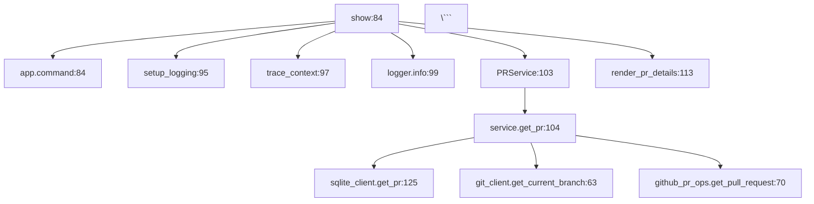

# Trace & Inspect Output Format Improvement Design

## Problem Statement

### Problem 1: `--trace` Output Mixed Content
**Current Issue:**
```bash
$ vibe3 pr show --trace
13:13:43 | INFO     | vibe3.observability.trace:trace_context:114 | Starting: pr show
13:13:43 | INFO     | vibe3.commands.pr:show:99 | Fetching PR details
13:13:44 | DEBUG    | vibe3.clients.sqlite_client:_init_db:124 | Database schema initialized
...日志混在一起...
13:13:45 | SUCCESS  | vibe3.observability.trace:trace_context:118 | Completed: pr show
PR #200: feat: codex auto-review...
```

**Pain Points:**
- Execution logs and command result mixed together
- Hard to distinguish execution flow from return value
- Not friendly for agent parsing

### Problem 2: `inspect` Lacks Hierarchy
**Current Issue:**
```bash
$ vibe3 inspect commands pr show
=== Call Chain: vibe pr show ===
  File  : src/vibe3/commands/pr.py
  Depth : 16
  L  84  show → app.command
  L  95  show → setup_logging
  L  97  show → trace_context
  ...平铺列表...
```

**Pain Points:**
- Flat list, no hierarchy visualization
- Caller-callee relationship unclear
- Hard to understand code structure at a glance

---

## Design Goals

1. **Agent-Friendly**: No fancy box drawing characters, easy to parse
2. **Human-Readable**: Clear structure, good aesthetics
3. **Explicit Separation**: Distinguish execution flow from results
4. **Multiple Formats**: Support YAML (default), JSON, Mermaid (optional)

---

## Design Proposal

### Solution 1: `--trace` Output Structure

#### Option A: Clear Section Separation (Recommended)

```bash
$ vibe3 pr show --trace

[TRACE] pr show
━━━━━━━━━━━━━━━━━━━━━━━━━━━━━━━━━━━━━━━━━━━━━━━━━

▶ Execution Flow:
  13:13:43 | INFO  | Fetching PR details
  13:13:44 | DEBUG | Database schema initialized
  13:13:44 | DEBUG | SQLite client initialized
  13:13:44 | DEBUG | Getting PR
  13:13:44 | DEBUG | Got current branch
  13:13:44 | DEBUG | Calling GitHub API: get_pull_request

▶ Result:
  PR #200: feat: codex auto-review 自动化审查系统
  Status: OPEN
  Branch: task/codex-auto-review → main
  URL: https://github.com/jacobcy/vibe-coding-control-center/pull/200

  Description:
  ## 概述
  实现 AI 驱动的自动化代码审查系统...

━━━━━━━━━━━━━━━━━━━━━━━━━━━━━━━━━━━━━━━━━━━━━━━━━
[13:13:45] Completed ✅
```

**Key Features:**
- Clear section headers with `▶` prefix (no box drawing)
- Simple `━━━` separator line (ASCII only)
- Explicit distinction between flow and result
- Agent can parse with regex: `^▶ (\w+):`

#### Option B: YAML-Style Output

```bash
$ vibe3 pr show --trace --yaml

trace:
  command: pr show
  status: completed

execution:
  - time: "13:13:43"
    level: INFO
    message: "Fetching PR details"
  - time: "13:13:44"
    level: DEBUG
    module: sqlite_client
    message: "Database schema initialized"
  - time: "13:13:44"
    level: DEBUG
    module: git_client
    message: "Got current branch"
  - time: "13:13:44"
    level: DEBUG
    module: github_pr_ops
    message: "Calling GitHub API: get_pull_request"

result:
  number: 200
  title: "feat: codex auto-review 自动化审查系统"
  status: OPEN
  branch:
    head: task/codex-auto-review
    base: main
  url: "https://github.com/jacobcy/vibe-coding-control-center/pull/200"
```

**Key Features:**
- Pure YAML structure, trivial to parse
- Structured data representation
- `--trace --yaml` combined flag
- Default remains human-readable text

#### Option C: JSON Output (with `--json`)

```bash
$ vibe3 pr show --trace --json

{
  "trace": {
    "command": "pr show",
    "status": "completed",
    "start_time": "2026-03-18T13:13:43",
    "end_time": "2026-03-18T13:13:45"
  },
  "execution": [
    {
      "time": "13:13:43",
      "level": "INFO",
      "message": "Fetching PR details"
    },
    {
      "time": "13:13:44",
      "level": "DEBUG",
      "module": "sqlite_client",
      "message": "Database schema initialized"
    }
  ],
  "result": {
    "number": 200,
    "title": "feat: codex auto-review 自动化审查系统",
    "status": "OPEN",
    "head_branch": "task/codex-auto-review",
    "base_branch": "main",
    "url": "https://github.com/jacobcy/vibe-coding-control-center/pull/200"
  }
}
```

---

### Solution 2: `inspect` Hierarchy Visualization

#### Option A: YAML Format (Default, Recommended)

```bash
$ vibe3 inspect commands pr show

command: pr show
file: src/vibe3/commands/pr.py
call_depth: 16

call_tree:
  - caller: show
    line: 84
    calls:
      - name: app.command
        line: 84
      - name: setup_logging
        line: 95
      - name: trace_context
        line: 97
      - name: logger.info
        line: 99
      - name: PRService
        line: 103
        calls:
          - name: service.get_pr
            line: 104
            calls:
              - name: sqlite_client.get_pr
              - name: git_client.get_current_branch
              - name: github_pr_ops.get_pull_request
      - name: render_pr_details
        line: 113
```

**Key Features:**
- YAML structure with indentation
- Recursive `calls` list for hierarchy
- Trivial to parse: `yaml.safe_load()`
- Clear parent-child relationship

#### Option B: JSON Format (with `--json`)

```bash
$ vibe3 inspect commands pr show --json

{
  "command": "pr show",
  "file": "src/vibe3/commands/pr.py",
  "call_depth": 16,
  "call_tree": [
    {
      "caller": "show",
      "line": 84,
      "calls": [
        {
          "name": "app.command",
          "line": 84
        },
        {
          "name": "setup_logging",
          "line": 95
        },
        {
          "name": "PRService",
          "line": 103,
          "calls": [
            {
              "name": "service.get_pr",
              "line": 104,
              "calls": [
                {
                  "name": "sqlite_client.get_pr",
                  "line": 125
                },
                {
                  "name": "git_client.get_current_branch",
                  "line": 63
                },
                {
                  "name": "github_pr_ops.get_pull_request",
                  "line": 70
                }
              ]
            }
          ]
        },
        {
          "name": "render_pr_details",
          "line": 113
        }
      ]
    }
  ]
}
```

#### Option C: Tree Text (ASCII Art, No Box)

```bash
$ vibe3 inspect commands pr show --tree

pr show (src/vibe3/commands/pr.py:84)
├─ app.command (L84)
├─ setup_logging (L95)
├─ trace_context (L97)
├─ logger.info (L99)
├─ PRService (L103)
│  └─ service.get_pr (L104)
│     ├─ sqlite_client.get_pr (L125)
│     ├─ git_client.get_current_branch (L63)
│     └─ github_pr_ops.get_pull_request (L70)
└─ render_pr_details (L113)
```

**Key Features:**
- ASCII tree characters (├─ └─ │)
- Clear hierarchy without boxes
- Human-readable
- Parseable with tree-traversal regex

#### Option D: Mermaid Diagram (Optional, Future)

```bash
$ vibe3 inspect commands pr show --mermaid



**Key Features:**
- Generate Mermaid flowchart code
- Render in GitHub, GitLab, Notion, etc.
- Not for terminal output
- Good for documentation

---

## Implementation Plan

### Phase 1: Data Model Enhancement

#### 1.1 Trace Output Model

```python
# src/vibe3/models/trace.py
from dataclasses import dataclass, field
from datetime import datetime
from typing import Any

@dataclass
class ExecutionStep:
    time: str
    level: str
    module: str
    function: str
    line: int
    message: str

@dataclass
class TraceOutput:
    command: str
    status: str
    start_time: datetime
    end_time: datetime | None = None
    execution: list[ExecutionStep] = field(default_factory=list)
    result: dict[str, Any] = field(default_factory=dict)

    def to_yaml(self) -> str:
        """Convert to YAML string."""
        pass

    def to_json(self) -> str:
        """Convert to JSON string."""
        pass

    def to_text(self) -> str:
        """Convert to human-readable text (Option A)."""
        pass
```

#### 1.2 Call Tree Model

```python
# src/vibe3/models/inspection.py
from dataclasses import dataclass, field
from typing import Any

@dataclass
class CallNode:
    name: str
    line: int
    calls: list["CallNode"] = field(default_factory=list)

@dataclass
class CommandInspection:
    command: str
    file: str
    call_depth: int
    call_tree: list[CallNode]

    def to_yaml(self) -> str:
        """Convert to YAML string."""
        pass

    def to_json(self) -> str:
        """Convert to JSON string."""
        pass

    def to_tree(self) -> str:
        """Convert to ASCII tree (Option C)."""
        pass

    def to_mermaid(self) -> str:
        """Convert to Mermaid diagram."""
        pass
```

### Phase 2: Format Detection Logic

```python
# src/vibe3/commands/pr.py

@app.command()
def show(
    pr_number: int | None = None,
    branch: str | None = None,
    trace: bool = False,
    json_output: bool = False,
    yaml_output: bool = False,  # New flag
) -> None:
    """Show PR details."""
    if trace:
        trace_output = TraceOutput(command="pr show", status="running")

        # Execute with trace collection
        service = PRService()
        pr = service.get_pr(pr_number, branch)

        # Populate trace output
        trace_output.result = pr.model_dump()
        trace_output.status = "completed"

        # Output in requested format
        if json_output:
            typer.echo(trace_output.to_json())
        elif yaml_output:
            typer.echo(trace_output.to_yaml())
        else:
            typer.echo(trace_output.to_text())
    else:
        # Original behavior
        ...
```

### Phase 3: Call Tree Builder

```python
# src/vibe3/services/command_analyzer.py

def analyze_command(command: str, subcommand: str | None) -> CommandInspection:
    """Analyze command and build call tree."""

    # Find command entry point
    file_path, entry_function = find_command_entry(command, subcommand)

    # Build call tree recursively
    call_tree = build_call_tree(file_path, entry_function)

    # Calculate max depth
    call_depth = calculate_max_depth(call_tree)

    return CommandInspection(
        command=f"{command} {subcommand}" if subcommand else command,
        file=file_path,
        call_depth=call_depth,
        call_tree=call_tree,
    )

def build_call_tree(file_path: str, function_name: str, visited: set | None = None) -> list[CallNode]:
    """Build call tree recursively."""
    if visited is None:
        visited = set()

    # Prevent infinite recursion
    if (file_path, function_name) in visited:
        return []
    visited.add((file_path, function_name))

    # Parse function calls
    calls = []
    for call in extract_function_calls(file_path, function_name):
        node = CallNode(name=call.callee, line=call.line)

        # Recursively build sub-tree
        if should_expand(call.callee):
            node.calls = build_call_tree(
                call.callee_file,
                call.callee_function,
                visited
            )

        calls.append(node)

    return calls
```

---

## Default Format Decision

### Trace Output
- **Default**: Option A (Structured Text with `▶` prefix)
- **Optional**: `--trace --json` or `--trace --yaml`

### Inspect Output
- **Default**: Option A (YAML format)
- **Optional**: `--json`, `--tree`, `--mermaid`

**Rationale:**
- YAML is most agent-friendly (trivial to parse)
- YAML is human-readable with clear hierarchy
- JSON for programmatic consumption
- Tree for quick terminal inspection
- Mermaid for documentation generation

---

## Trade-offs

### YAML as Default
**Pros:**
- ✅ Trivial to parse: `yaml.safe_load()`
- ✅ Clear hierarchy with indentation
- ✅ Standard data serialization format
- ✅ Works well with tools (yq, yamllint)

**Cons:**
- ⚠️ Slightly more verbose than tree
- ⚠️ Requires YAML library (already in dependencies)

### ASCII Tree
**Pros:**
- ✅ Compact and visual
- ✅ No external dependencies
- ✅ Familiar to Unix users

**Cons:**
- ⚠️ Requires custom parser
- ⚠️ Not a standard format
- ⚠️ Harder to process programmatically

---

## Future Enhancements

1. **Mermaid Diagram Generation** (`--mermaid`)
   - Generate flowchart code for rendering
   - Useful for documentation and presentations

2. **Interactive Mode** (`--interactive`)
   - Collapse/expand nodes
   - Navigate call tree with keyboard

3. **Performance Profiling** (`--profile`)
   - Add timing information to trace
   - Highlight performance bottlenecks

4. **Call Graph Visualization**
   - Export to Graphviz DOT format
   - Generate SVG/PNG call graph

---

## Acceptance Criteria

### Trace Output
- [ ] Clear separation between execution flow and result
- [ ] YAML format support with `--trace --yaml`
- [ ] JSON format support with `--trace --json`
- [ ] Human-readable text format (default)
- [ ] Agent-parsable with simple regex

### Inspect Output
- [ ] YAML format as default
- [ ] JSON format with `--json`
- [ ] ASCII tree format with `--tree`
- [ ] Recursive call tree structure
- [ ] No box-drawing characters in YAML/JSON

### Code Quality
- [ ] Type hints for all new models
- [ ] Unit tests for each output format
- [ ] Docstrings with examples
- [ ] PEP 8 compliance

---

## References

- [SOUL.md](../../SOUL.md) - Project constitution
- [YAML 1.2 Specification](https://yaml.org/spec/1.2.2/)
- [Mermaid Flowchart Syntax](https://mermaid.js.org/syntax/flowchart.html)
- [Python AST Module](https://docs.python.org/3/library/ast.html)